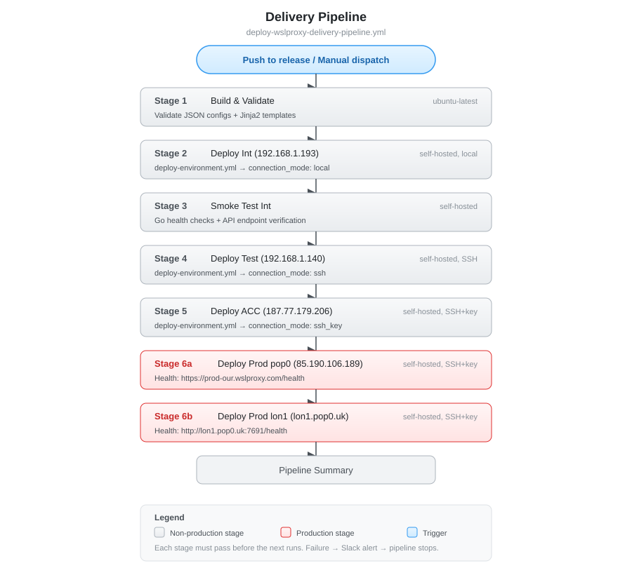
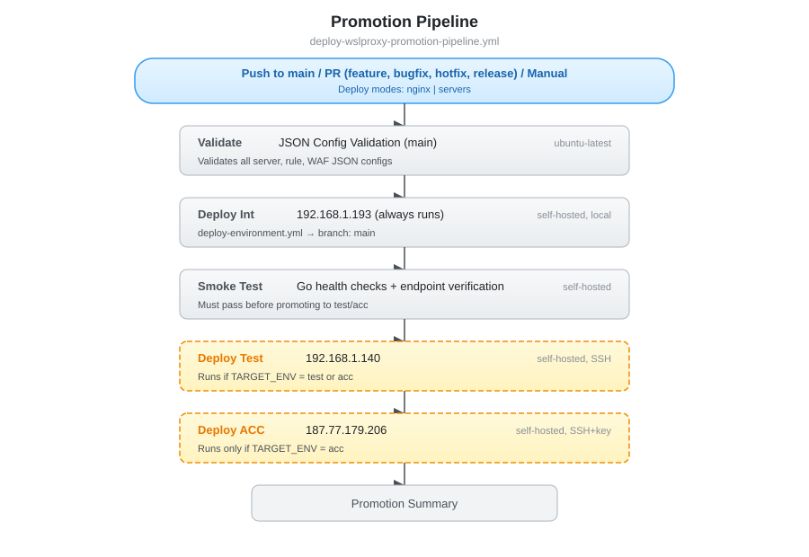

# WSLProxy CI/CD Pipelines

## Overview

WSLProxy uses two deployment pipelines and a shared reusable workflow:

| Pipeline | File | Branch | Environments | Purpose |
|----------|------|--------|-------------|---------|
| **Delivery** | `deploy-wslproxy-delivery-pipeline.yml` | `release` | int → test → prod (lon1 + pop1) | Production releases |
| **Promotion** | `deploy-wslproxy-promotion-pipeline.yml` | `main` | int → test | CI/CD for config/server changes |
| **Reusable** | `deploy-environment.yml` | — | (called by both pipelines) | Parameterized per-environment deploy logic |

> The `acc` tier on 187.77.179.206 was decommissioned. Both pipelines now go test → prod (delivery) or stop at test (promotion).

> `deploy-diytaxreturn-configs.yml` was retired on 2026-09-01. It targeted the
> decommissioned 187.77.179.206 and an `[openresty_diytaxreturn]` inventory group
> that no commit ever added, so all 12 of its runs failed — while firing on every
> merge that touched `data/servers/**` or `data/rules/**`. diytaxreturn config is
> owned by the app repo (`diy-tax-return-uk/.github/wslproxy/data/`) and imported
> through `/api/projects/import`.

---

## Pipeline Flow Diagrams

### Delivery Pipeline Flow


### Promotion Pipeline Flow


---

## Delivery Pipeline (`deploy-wslproxy-delivery-pipeline.yml`)

Full production release pipeline with fail-fast behavior and Slack notifications at every gate. Code promotes through **int → test → prod (lon1 + pop1)** — each environment must pass before the next deploys.

### Triggers

| Trigger | Branches | Behavior |
|---------|----------|----------|
| Push | `release` | Runs full pipeline: int → test → prod (lon1 + pop1) |
| Manual (`workflow_dispatch`) | any | Choose target host, environment, and deploy mode |

### Deploy Modes

Selected via `DEPLOY_MODE` dropdown (default: `code` for manual, `full` for push to release):

| Mode | `DEPLOY_MODE` | What runs |
|------|---------------|-----------|
| **Code deploy** (manual default) | `code` | Lua API, HTML, settings, nginx conf, restart |
| **Nginx config** | `nginx` | Nginx conf dirs, tenants, cron, systemd, PAM, SSL, restart |
| **Virtual servers** | `servers` | Server/rule data configs, settings, SSL, tenant configs, restart |
| **Dashboard** | `dashboard` | React admin UI build + deploy, restart |
| **OS dependencies** | `os_deps` | apt/zypper/yum package updates |
| **Build OpenResty** | `build` | OS deps + OpenResty compile + luarocks + CDN deps |
| **Full deploy** (push default) | `full` | Everything |

### Pipeline Stages

```
 ┌──────────────────────────────────────────────────────────────────────┐
 │                         PUSH TO release                             │
 └──────────────────────────┬───────────────────────────────────────────┘
                            │
                            ▼
 ┌──────────────────────────────────────────────────────────────────────┐
 │  STAGE 1: Build & Validate                        [ubuntu-latest]   │
 │  - Validate all JSON configs (servers, rules, WAF rules, policies)  │
 │  - Validate Jinja2 templates (Ansible roles)                        │
 │  ✗ Failure → Slack alert → pipeline stops                           │
 └──────────────────────────┬───────────────────────────────────────────┘
                            │ pass
                            ▼
 ┌──────────────────────────────────────────────────────────────────────┐
 │  STAGE 2: Deploy Int                    [self-hosted, local]        │
 │  Uses deploy-environment.yml (connection_mode: local)               │
 │  ✗ Failure → Slack alert → pipeline stops                           │
 └──────────────────────────┬───────────────────────────────────────────┘
                            │ pass
                            ▼
 ┌──────────────────────────────────────────────────────────────────────┐
 │  STAGE 3: Smoke Test Int                          [self-hosted]     │
 │  - Go health check tests (QA/01_healthcheck_test.go)                │
 │  - API endpoint verification (/health, /api/*)                      │
 │  ✗ Failure → Slack alert → pipeline stops before test               │
 └──────────────────────────┬───────────────────────────────────────────┘
                            │ pass
                            ▼
 ┌──────────────────────────────────────────────────────────────────────┐
 │  STAGE 4: Deploy Test                   [self-hosted, SSH]          │
 │  Uses deploy-environment.yml (connection_mode: ssh)                 │
 │  ✗ Failure → Slack alert → pipeline stops before production         │
 └──────────────────────────┬───────────────────────────────────────────┘
                            │ pass
                            ▼
 ┌──────────────────────────────────────────────────────────────────────┐
 │  STAGE 5a: Deploy Prod lon1             [self-hosted, SSH+key]      │
 │  Uses deploy-environment.yml (connection_mode: ssh_key)             │
 │  ✓ Success → Slack: "deployed to production (lon1)"                 │
 │  ✗ Failure → Slack alert + manual rollback                          │
 └──────────────────────────┬───────────────────────────────────────────┘
                            │ pass
                            ▼
 ┌──────────────────────────────────────────────────────────────────────┐
 │  STAGE 5b: Deploy Prod lon1             [self-hosted, SSH+key]      │
 │  Uses deploy-environment.yml (connection_mode: ssh_key)             │
 │  ✓ Success → Slack: "deployed to LON1"                              │
 │  ✗ Failure → Slack alert + manual rollback                          │
 └──────────────────────────┬───────────────────────────────────────────┘
                            │
                            ▼
 ┌──────────────────────────────────────────────────────────────────────┐
 │  PIPELINE SUMMARY (always runs)                   [ubuntu-latest]   │
 │  Reports pass/fail for all stages. Exits with error if any failed.  │
 └──────────────────────────────────────────────────────────────────────┘
```

---

## Promotion Pipeline (`deploy-wslproxy-promotion-pipeline.yml`)

Lightweight CI/CD pipeline for deploying config and server changes from `main` through non-production environments. No full builds, no production deployments.

### Triggers

| Trigger | Branches | Behavior |
|---------|----------|----------|
| Push | `main` | Validates and deploys through int → test |
| Pull Request | `feature/*`, `bugfix/*`, `hotfix/*`, `release/*`, `main` | Validates and deploys through int → test |
| Manual (`workflow_dispatch`) | — | Choose deploy mode (`nginx` or `servers`) and how far to promote |

### Deploy Modes

Limited to config-only changes:

| Mode | `DEPLOY_MODE` | What runs |
|------|---------------|-----------|
| **Nginx config** (default: `servers`) | `nginx` | Nginx conf dirs, tenants, cron, systemd, PAM, SSL, restart |
| **Virtual servers** | `servers` | Server/rule data configs, settings, SSL, tenant configs, restart |

### Pipeline Stages

```
 ┌──────────────────────────────────────────────────────────────────────┐
 │  PUSH TO main / PR / manual dispatch                                │
 └──────────────────────────┬───────────────────────────────────────────┘
                            │
                            ▼
 ┌──────────────────────────────────────────────────────────────────────┐
 │  Validate: JSON configs on main branch            [ubuntu-latest]   │
 └──────────────────────────┬───────────────────────────────────────────┘
                            │ pass
                            ▼
 ┌──────────────────────────────────────────────────────────────────────┐
 │  Deploy Int (192.168.1.193)                       [self-hosted]     │
 │  Always runs                                                        │
 └──────────────────────────┬───────────────────────────────────────────┘
                            │ pass
                            ▼
 ┌──────────────────────────────────────────────────────────────────────┐
 │  Smoke Test Int                                   [self-hosted]     │
 │  Go health checks + endpoint verification                           │
 └──────────────────────────┬───────────────────────────────────────────┘
                            │ pass
                            ▼
 ┌──────────────────────────────────────────────────────────────────────┐
 │  Deploy Test (192.168.1.140)                      [self-hosted]     │
 │  Runs if TARGET_ENV is test                                         │
 └──────────────────────────────────────────────────────────────────────┘
```

---

## Reusable Deploy Workflow (`deploy-environment.yml`)

Shared parameterized workflow called by both pipelines via `workflow_call`. Handles all per-environment deployment logic with conditional steps.

### Key Parameters

| Parameter | Values | Description |
|-----------|--------|-------------|
| `connection_mode` | `local`, `ssh`, `ssh_key` | How to connect to the target host |
| `secrets_mode` | `github_secret`, `runner_file` | Where settings/env files come from |
| `health_check_mode` | `local`, `ssh`, `external` | How to verify the health endpoint |
| `deploy_mode` | `code`, `nginx`, `servers`, `dashboard`, `os_deps`, `build`, `full` | Maps to Ansible tags |

### Environment Configuration

| Environment | Host IP | SSH User | `connection_mode` | `secrets_mode` | `health_check_mode` | Health Endpoint |
|-------------|---------|----------|--------------------|----------------|---------------------|-----------------|
| int | 192.168.1.193 | (local) | `local` | `github_secret` | `local` | `http://localhost:8080/health` |
| test | 192.168.1.140 | bwalia | `ssh` | `runner_file` | `ssh` | `http://localhost:8080/health` |
| prod (lon1) | 195.20.255.201 | root | `ssh_key` | `vault_or_sops` | `external` | `https://lon1.pop0.uk/healthz` |
| prod (pop1) | 18.133.126.242 | admin | `ssh_key` | `vault_or_sops` | `external` | `https://pop1.diytaxreturn.co.uk/healthz` |

| prod (pop0) | 85.190.106.189 | administrator | `ssh_key` | `vault_or_sops` | `ssh` | `http://127.0.0.1:7691/healthz` |

> **pop0 rebuilt (2026-08-28):** the old pop0 host `187.124.112.155` was retired (it is a k3s node where traefik owns `:80`/`:443`). pop0 now lives on a new VPS, `85.190.106.189`, SSH user `administrator` (passwordless sudo, no root login). It is **dispatch-only** — Stage 5c of the delivery pipeline and `ENV=prod-pop0` in `deploy-single-environment.yml`; a push to `main`/`release` and `TARGET_HOST=all` both skip it. Its health gate runs over SSH against `127.0.0.1:7691` because no DNS points at the new IP yet (`prod-our.wslproxy.com` still resolves to lon1) — switch it to `external` after repointing DNS.

### Steps (conditional per environment)

1. Checkout code
2. Install Ansible
3. Decode secrets from GitHub Secret **or** validate from runner file
4. Setup SSH + test connectivity (remote only)
5. Docker prune (optional)
6. Run Ansible playbook with `DEPLOY_MODE` → Ansible tags
7. Deploy server/rule configs via `deploy-configs.yml`
8. Post-deploy health gate (nginx -t, systemctl, health endpoint)
9. Slack notifications (failure always, success optional)

---

## Ansible Deploy Modes (Tags)

The `DEPLOY_MODE` value maps to Ansible tags that control which tasks run:

| Tag | Tasks included |
|-----|---------------|
| `code` | Lua API, HTML, settings, nginx conf, permissions, restart |
| `nginx` | Nginx conf dirs, tenants, cron, systemd, PAM, SSL, varnish, restart |
| `servers` | Server/rule data configs, settings, SSL, tenant configs, restart |
| `dashboard` | React admin UI sync, npm/yarn build, nginx conf, restart |
| `os_deps` | OS package updates (apt/zypper/dnf) |
| `build` | `os_deps` + OpenResty compile + luarocks + CDN deps |
| `full` | No tag filter — all tasks run |
| `always` | Auto-detect OpenResty, load vars, user setup (runs in every mode) |

---

## Secrets

| Secret | Used by | Description |
|--------|---------|-------------|
| `DOT_WSLPROXY_SETTINGS_INT` | Int deploy | Base64-encoded settings.json for int |
| `DOT_WSLPROXY_ENV_CREDS_INT` | Int deploy | Base64-encoded .env for int |
| `DOT_WSLPROXY_SETTINGS_PROD` | Prod deploy (lon1/pop1) | Base64-encoded settings.json for prod |
| `DOT_WSLPROXY_ENV_CREDS_PROD` | Prod deploy (lon1/pop1) | Base64-encoded .env for prod |
| `SLACK_WEBHOOK` | All stages | Slack incoming webhook URL |
| `AWS_ACCESS_KEY_ID` / `AWS_SECRET_ACCESS_KEY` / `AWS_REGION` | `sync-prod-data-to-s3`, `sync-configs-to-environments`, `deploy-wslproxy-virtual-servers` | IAM user credentials for the S3 data bucket |
| `WSLPROXY_S3_BUCKET` | Same three workflows | Bucket holding `data/servers/<env>/` and `data/rules/<env>/` |

Those three workflows run `.github/actions/aws-s3-preflight` before any transfer.
It probes `sts:GetCallerIdentity` and one `s3 ls`, so a rotated, revoked or
AWS-quarantined key is named as such instead of surfacing as a bare `AccessDenied`
from inside `aws s3 sync`. It fails the job where S3 is the source of truth and
only warns where the S3 step is a best-effort overlay.

Runner-local secrets (on 192.168.1.193):

```
/home/bwalia/.secrets/wslproxy/
├── int/     → settings.json + .env (BACKEND_HOST=192.168.1.193)
├── test/    → settings.json + .env (BACKEND_HOST=192.168.1.140)
└── lon1/    → settings.json + .env (BACKEND_HOST=195.20.255.201)
```

---

## Smoke Tests & Health Checks

Each deployment stage runs post-deploy health gates before promoting to the next environment:

1. `openresty -t` — nginx config syntax validation
2. `systemctl is-active openresty` — service running check
3. Health endpoint curl (12 retries x 5s) — HTTP 200 required

### Go Tests (Stage 3 / Smoke Test Int)

| File | Framework | What it tests |
|------|-----------|--------------|
| `QA/01_healthcheck_test.go` | Go `testing` | `/ping` endpoint returns JSON with `redis_status_msg`, `pod_uptime`, `node_uptime` |

Run locally:
```bash
cd QA
TARGET_HOST=http://192.168.1.193:8080 go test -v -run TestHealthCheck -timeout 60s
```

### API Endpoint Verification (Stage 3)

| Endpoint | Type | Required |
|----------|------|----------|
| `/health` | Core health check | Yes (blocks pipeline) |
| `/api/servers` | Server configs API | No (skip if admin UI disabled) |
| `/api/rules` | Rule configs API | No (skip if admin UI disabled) |
| `/api/waf_rules` | WAF rules API | No (skip if admin UI disabled) |
| `/api/waf_policies` | WAF policies API | No (skip if admin UI disabled) |

### JSON Config Validation (Stage 1)

| Validation | Tool | Scope |
|------------|------|-------|
| Server configs | `python3 -m json.tool` | `data/servers/**/*.json` |
| Rule configs | `python3 -m json.tool` | `data/rules/**/*.json` |
| WAF rules | `python3 -m json.tool` | `data/waf_rules/**/*.json` |
| WAF policies | `python3 -m json.tool` | `data/waf_policies/**/*.json` |
| Jinja2 templates | `jinja2.Environment.parse()` | `infra/ansible/roles/**/*.j2` |

---

## Fail-Fast Behavior

Both pipelines stop immediately on failure and send Slack alerts:

### Delivery Pipeline
```
Stage 1 fails  → "Build & Validate FAILED"              → pipeline stops
Stage 2 fails  → "Deploy Int FAILED"                    → pipeline stops
Stage 3 fails  → "Smoke Test Int FAILED"                → pipeline stops (before test)
Stage 4 fails  → "Deploy Test FAILED"                   → pipeline stops (before prod)
Stage 5a fails → "Production Deployment FAILED (lon1)"  → alert + manual rollback
Stage 5b fails → "Production Deployment FAILED (pop1)"  → alert + manual rollback
```

### Promotion Pipeline
```
Validate fails     → pipeline stops
Deploy Int fails   → pipeline stops
Smoke Test fails   → pipeline stops (before test)
Deploy Test fails  → alert
```

### Rollback

- **Non-production failure**: Fix the issue and push again.
- **Production failure**: Re-run the delivery pipeline from a previous known-good commit on the `release` branch.

---

## Other Workflows

| Workflow | File | Purpose |
|----------|------|---------|
| Deploy Virtual Servers | `deploy-wslproxy-virtual-servers.yml` | Deploy server/rule JSON configs + optional nginx conf via Ansible |
| Reusable Deploy | `deploy-environment.yml` | Parameterized per-environment deploy (called by both pipelines) |
| E2E Tests | `e2e-tests.yml` | Playwright browser tests against deployed frontend |
| API Test Suite | `automated-api-test-suite.yml` | Go-based API integration tests |
| UI Smoke Test | `automated-ui-smoke-test.yml` | Cypress UI smoke tests |
| Backup Data | `backup-wslproxy-data.yml` | Backup WSLProxy data from production |
