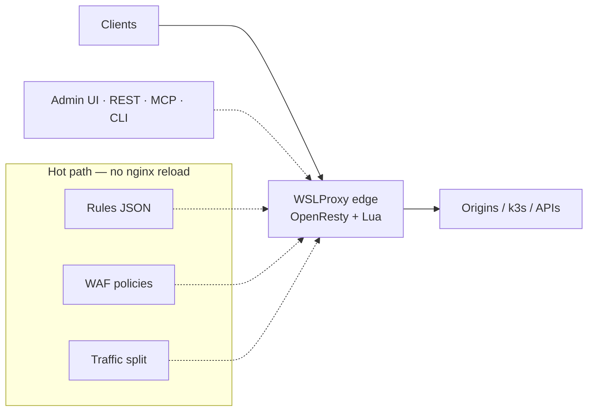
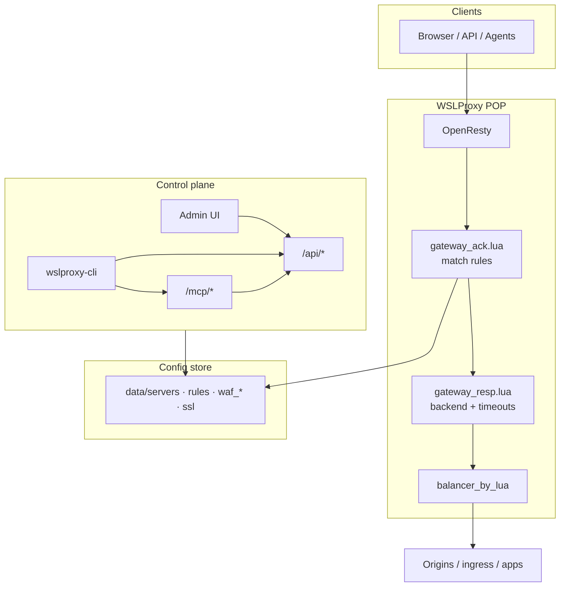
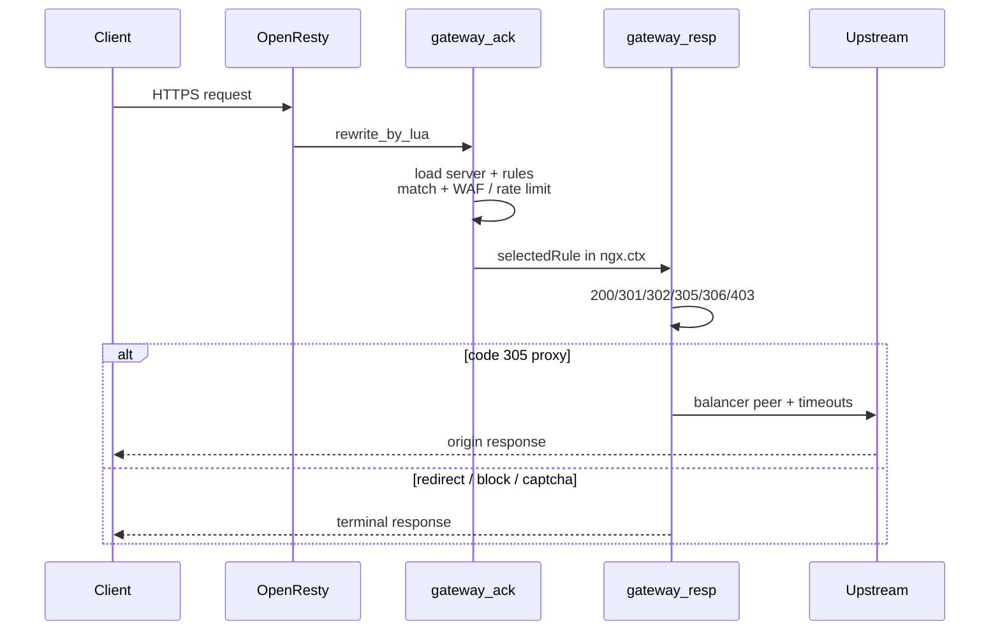
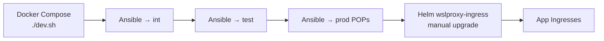

# WSLProxy

**Dynamic API gateway & reverse proxy** on OpenResty — route, secure, and observe traffic from JSON/MCP configs that take effect **without reloading nginx** for rules.

Operators manage virtual hosts, rules, WAF, cache, traffic splits, and edge POPs from an Admin UI, REST API, MCP tools, or the `wslproxy-cli` container. Built for multi-POP edges, GitOps-style config, and AI agents.

| | |
|---|---|
| Site | [wslproxy.org](https://wslproxy.org) (GitHub Pages) · [wslproxy.com](https://wslproxy.com) |
| Swagger | [wslproxy.org/swagger/](https://wslproxy.org/swagger/) |
| Repo | [github.com/bwalia/wslproxy](https://github.com/bwalia/wslproxy) |
| CLI image | `ghcr.io/bwalia/wslproxy-cli:latest` |

Landing + Swagger are published from `html/` by [`.github/workflows/deploy-pages.yml`](.github/workflows/deploy-pages.yml) on every `main` change to those paths (same pattern as ring-promoter).

---

## What it is

WSLProxy sits in front of your origins and decides **per request** what happens: proxy (305), redirect, static block, CAPTCHA, WAF, cache, canary split, geo/IP/JWT match — using rules loaded live from disk or Redis.



**Reload only when server-level nginx conf changes** (new listen/SSL block). Rules, WAF, and most routing are evaluated every request.

---

## Capabilities (today)

| Area | What you get |
|------|----------------|
| **Routing** | Path / IP / country / JWT / S3 / cookie match → proxy, redirect, HTML, CAPTCHA; priority + specificity tie-break |
| **Traffic** | Weighted / RR / header canary / cookie sticky / least-conn; promote & rollback backends |
| **WAF** | Policy packs, anomaly scoring, monitor/block, events API — see [docs/WAF_ENGINE_V2.md](docs/WAF_ENGINE_V2.md) |
| **SSL** | auto-ssl / Let's Encrypt, per-domain SSL JSON, force HTTPS |
| **Cache** | Edge static cache + optional Docker blob cache; Varnish hooks |
| **POPs + DNS** | Declare edge locations; Cloudflare A-record provisioning with safety guardrails — [POPS_AND_DNS_GUIDE.md](POPS_AND_DNS_GUIDE.md) |
| **Control plane** | React Admin + Next.js dashboard, Swagger REST, MCP (Claude/Cursor), `wslproxy-cli` |
| **Deploy** | Docker Compose (dev), Ansible (bare metal / VM), Helm ingress-controller (k3s) |
| **Observability** | `/health` `/healthz` `/ready` `/metrics`, traffic stats, AI log analysis hooks |

---

## Architecture



**Two-layer prod pattern (common):** public POP → k3s NodePort → `wslproxy-ingress` Helm chart → app pods. Tune timeouts on **both** layers.

More diagrams (Draw.io): [docs/diagrams/](docs/diagrams/).

---

## Quick start

### Docker (local)

```bash
git clone https://github.com/bwalia/wslproxy.git && cd wslproxy
./dev.sh -n -j "$(openssl rand -hex 24)"
# Admin: http://localhost:8280   API: http://localhost:8280/api   Health: /health
```

Or compose: `docker-compose -f docker-compose-local.yml up` (see [DOCKER.md](DOCKER.md)).

### CLI in CI (no Go install)

```bash
docker run --rm \
  -e WSLPROXY_BASE_URL=https://your-pop.example \
  -e WSLPROXY_TOKEN \
  ghcr.io/bwalia/wslproxy-cli:latest check nginx -o json
```

Docs: [docs/wslproxy-cli.md](docs/wslproxy-cli.md) · examples under `examples/wslproxy-cli/`.

### Login + pull / push config

```bash
wslproxy-cli auth login --base-url https://lon1.pop0.uk -u you@example.com
wslproxy-cli pull -d ./cfg --resources servers,rules,waf_rules,waf_policies
# edit JSON or jq …
wslproxy-cli push -d ./cfg --dry-run --diff
wslproxy-cli push -d ./cfg --yes --verify
```

---

## Request pipeline (simplified)



---

## Repository map

| Path | Role |
|------|------|
| `api/` | Lua gateway + REST + MCP (hot-reloaded) |
| `data/` | Servers, rules, WAF, SSL JSON (per env profile) |
| `openresty-admin/` | React Admin UI |
| `openresty-admin-next/` | Next.js ops dashboard |
| `html/` | Public landing + swagger |
| `cmd/wslproxy-cli/` | Go CLI + Dockerfile |
| `infra/ansible/` | Production deploy (OpenResty build, nginx, data, UIs) |
| `ingress-controller/` | k3s Helm ingress chart |
| `docs/` | Guides (MCP, WAF, CLI, diagrams) |

Developer deep-dive: [CLAUDE.md](CLAUDE.md).

---

## Deploy paths



- **Delivery pipeline:** `.github/workflows/deploy-wslproxy-delivery-pipeline.yml` (int → smoke → test → prod)
- **CLI binaries + image:** `.github/workflows/build-wslproxy-cli.yml` → GHCR + release `wslproxy-cli-latest`
- Ansible playbook: `infra/ansible/wslproxy-ops.yml`

---

## MCP (AI agents)

Enable in `data/settings.json` → `mcp`. Endpoints: `/mcp/manifest`, `/mcp/tools`, `/mcp/jsonrpc`.

Tools include `validate_config`, CRUD for servers/rules, WAF bind, traffic promote/rollback, POPs/DNS — see [docs/mcp.md](docs/mcp.md) and [api/mcp/README.md](api/mcp/README.md).

---

## Documentation index

| Doc | Topic |
|-----|--------|
| [docs/wslproxy-cli.md](docs/wslproxy-cli.md) | CLI + Docker CI usage |
| [docs/WAF_ENGINE_V2.md](docs/WAF_ENGINE_V2.md) | WAF engine |
| [docs/mcp.md](docs/mcp.md) / [mcp-gateway.md](docs/mcp-gateway.md) | MCP |
| [POPS_AND_DNS_GUIDE.md](POPS_AND_DNS_GUIDE.md) | POPs & Cloudflare DNS |
| [DOCKER.md](DOCKER.md) / [DOCKER-DEPLOYMENT.md](DOCKER-DEPLOYMENT.md) | Containers |
| [docs/diagrams/](docs/diagrams/) | Draw.io architecture set |
| [examples/wslproxy-waf-demo/](examples/wslproxy-waf-demo/) | WAF demo pack |

---

## Local URLs (`./dev.sh`)

| Service | URL |
|---------|-----|
| Admin | http://localhost:8280 |
| API / Swagger | http://localhost:8280/api · /swagger/ |
| Health | http://localhost:8280/health |
| Proxy HTTP/HTTPS | http://localhost:8180 · https://localhost:8443 |

---

## Contributing

PRs against `main`. Prefer small, focused changes. Do not commit real `settings.json` secrets or `.env` credentials.

## License

See repository license file.
