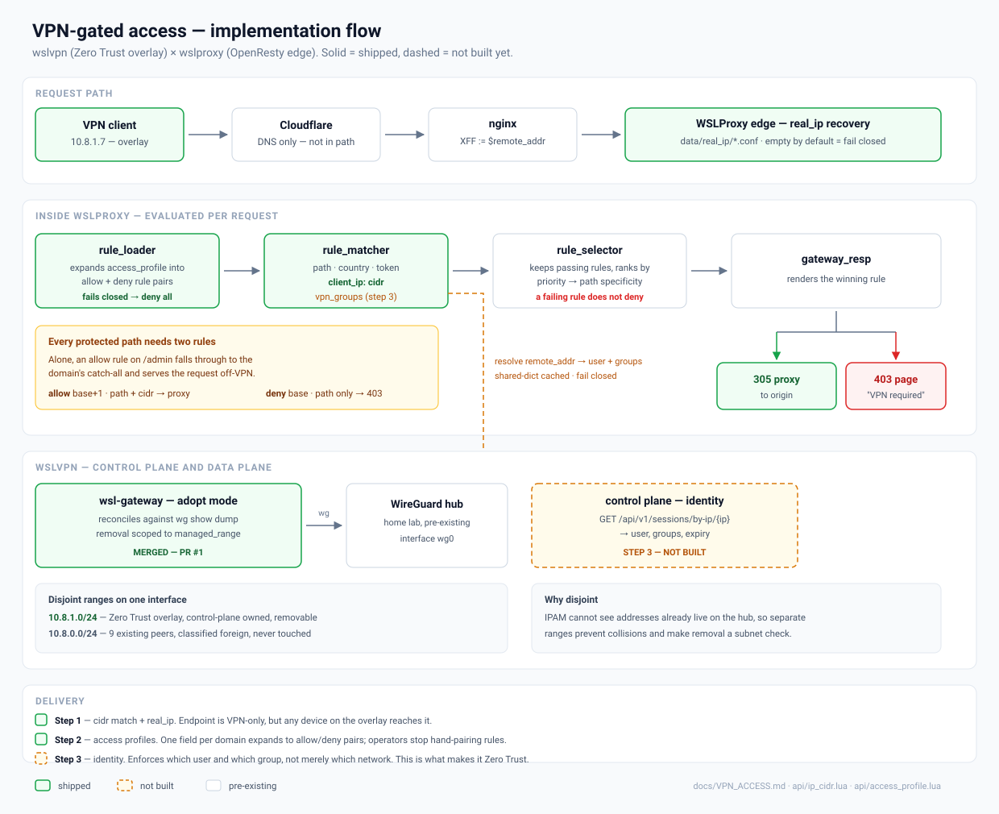

# VPN-only access

Restrict endpoints to clients connected through the
[wslvpn](https://github.com/bwalia/wslvpn) Zero Trust overlay, using a `cidr`
match on the client IP.

This is the network layer: *"the request arrived over the VPN."* It does not yet
know **who** the user is — that comes with identity resolution (see
[Not yet covered](#not-yet-covered)).

**Most people want [access profiles](#access-profiles)** — one field on a domain,
and the allow/deny rule pairs are generated for you. The hand-written rule
sections below explain what a profile expands into and why; read them if you are
debugging a profile or need something a profile cannot express.



## Prerequisite: real client IP

`cidr` rules match `ngx.var.remote_addr`. If anything sits in front of WSLProxy,
that is the proxy's address, not the client's, and every VPN rule will deny.

Configure [`data/real_ip/`](../data/real_ip/README.md) first. Verify before
writing rules:

```bash
curl -sI https://your-host/ | grep -i x-origin-ip
```

It must show a client address, not your front proxy.

## The `cidr` match

```json
"client_ip_key": "cidr",
"client_ip": "10.8.1.0/24"
```

- Accepts one CIDR or a comma-separated list: `"10.8.1.0/24, 10.9.0.0/16"`
- A bare address is treated as `/32`
- IPv4 only — an IPv6 client never matches, so it cannot pass an IPv4 allowlist
- Malformed entries match nothing; one bad entry in a list does not affect the others

Use `cidr`, not `starts_with`. String prefix matching is not subnet matching:
`starts_with "10.8.1."` also matches `10.8.1x.y.z`-shaped addresses in other
ranges, and this is an access decision.

## Rules come in pairs

**This is the part to get right.** A single VPN-only rule is a silent bypass.

`rule_selector.lua` filters to the rules that *pass*, then ranks them. A rule
whose IP condition fails simply drops out of the running — it does not deny
anything. So with only:

| Rule | Path | Condition | Response |
|------|------|-----------|----------|
| A | `/admin` starts_with | `cidr 10.8.1.0/24` | 305 proxy |
| B | `/` starts_with | none | 305 proxy |

an off-VPN request to `/admin` fails rule A, matches the catch-all rule B, and
**gets proxied to `/admin` anyway**.

You need an explicit deny that catches what the allow rule drops:

| Rule | Priority | Path | Condition | Response |
|------|----------|------|-----------|----------|
| allow | 20 | `/admin` starts_with | `cidr 10.8.1.0/24` | 305 proxy |
| deny | 10 | `/admin` starts_with | none | 403 page |
| catch-all | 0 | `/` starts_with | none | 305 proxy |

On-VPN, both `/admin` rules pass and the higher priority wins → proxied.
Off-VPN, only the deny rule passes → 403. The catch-all never sees `/admin`
either way, because both `/admin` rules outrank it on priority.

Give the allow rule a **higher explicit priority** than the deny rule. The
selector would also break the tie by condition count (`compare_rules` step 3),
but relying on that is fragile — state the priority.

## Worked example

Allow:

```json
{
  "version": 1,
  "priority": 20,
  "name": "admin-vpn-allow",
  "profile_id": "prod",
  "servers": ["host:internal.example.com"],
  "match": {
    "rules": {
      "path_key": "starts_with",
      "path": "/admin",
      "client_ip_key": "cidr",
      "client_ip": "10.8.1.0/24"
    },
    "response": {
      "allow": true,
      "code": 305,
      "redirect_uri": "http://127.0.0.1:8080"
    }
  }
}
```

Deny — same path, no IP condition, lower priority:

```json
{
  "version": 1,
  "priority": 10,
  "name": "admin-vpn-deny",
  "profile_id": "prod",
  "servers": ["host:internal.example.com"],
  "match": {
    "rules": {
      "path_key": "starts_with",
      "path": "/admin"
    },
    "response": {
      "allow": false,
      "code": 403,
      "message": "<base64-encoded HTML>"
    }
  }
}
```

`403` renders `message` as HTML (`gateway_resp.lua`), so off-VPN users get a
"connect to the VPN" page rather than a bare error. Both rules are created
through the existing `POST /api/rules` endpoint — no new API.

## Access profiles

Writing those pairs by hand across several domains means remembering the pairing
every time, and one forgotten deny rule is a silent hole. An **access profile**
is a named bundle of protected endpoints that a domain attaches with one field.
It expands to exactly the rules above at load time — same matcher, same
selector, same response contract — so there is nothing new to reason about at
request time.

### Attach it

One field on the server config (`data/servers/<env>/host:<domain>.json`):

```json
{
  "id": "host:internal.example.com",
  "server_name": "internal.example.com",
  "proxy_pass": "http://127.0.0.1:8080",
  "access_profile": "staff-internal"
}
```

The same profile can be attached to as many domains as you like, and different
domains can use different profiles.

### Define it

`data/access_profiles/<env>/<name>.json` — see
[`staff-internal.json`](../data/access_profiles/prod/staff-internal.json):

```json
{
  "name": "staff-internal",
  "allow_cidrs": "10.8.1.0/24",
  "endpoints": [
    { "path": "/admin",         "path_key": "starts_with" },
    { "path": "/api/internal",  "path_key": "starts_with" },
    { "path": "/metrics",       "path_key": "equals" },
    { "path": "/admin/billing", "path_key": "starts_with", "allow_cidrs": "10.8.1.16/28" }
  ]
}
```

`<env>` is the environment profile (`prod`, `acc`, `dev`) — the same directory
convention as `data/rules/` and `data/servers/`. Unrelated to `access_profile`,
which names the bundle.

### Fields

| Field | Required | Default | Meaning |
|-------|----------|---------|---------|
| `name` | yes | — | Profile name; must match the filename |
| `endpoints` | yes | — | Protected endpoints; at least one |
| `endpoints[].path` | yes | — | Path to protect |
| `endpoints[].path_key` | no | `starts_with` | `starts_with`, `ends_with` or `equals` |
| `endpoints[].allow_cidrs` | no | profile `allow_cidrs` | Ranges allowed to reach this endpoint |
| `endpoints[].origin` | no | profile `origin`, else server `proxy_pass` | Where allowed requests are proxied |
| `allow_cidrs` | no | — | Default range for every endpoint |
| `origin` | no | server `proxy_pass` | Default origin for every endpoint |
| `priority_base` | no | `1000` | Base priority for generated rules |
| `deny_code` | no | `403` | Status for denied requests |
| `deny_message` | no | built-in "VPN required" page | Base64 HTML shown on deny |

Every endpoint needs a range from somewhere — its own `allow_cidrs` or the
profile's. A profile with neither is rejected rather than expanded, since an
allow rule with no range could never pass and the endpoint would be permanently
unreachable.

### What it generates

Each endpoint becomes the allow/deny pair described above:

For the example profile above, least specific first:

```
ap:staff-internal:1:deny    priority 1000   /admin starts_with                   → 403
ap:staff-internal:1:allow   priority 1001   /admin + cidr 10.8.1.0/24            → 305
ap:staff-internal:2:deny    priority 1002   /api/internal starts_with            → 403
ap:staff-internal:2:allow   priority 1003   /api/internal + cidr 10.8.1.0/24     → 305
ap:staff-internal:3:deny    priority 1004   /admin/billing starts_with           → 403
ap:staff-internal:3:allow   priority 1005   /admin/billing + cidr 10.8.1.16/28   → 305
ap:staff-internal:4:deny    priority 1006   /metrics equals                      → 403
ap:staff-internal:4:allow   priority 1007   /metrics + cidr 10.8.1.0/24          → 305
```

Two properties worth knowing:

**Priorities follow path specificity**, least specific first, so a narrower
endpoint's *deny* (1004) outranks a broader endpoint's *allow* (1001). That is
what makes the last entry work: someone on `10.8.1.7` is allowed at `/admin`
but still denied at `/admin/billing`, which requires `10.8.1.16/28`. Without
that ordering the broader `/admin` allow would win and the narrower restriction
would do nothing.

Note `/metrics` ranks highest despite being the shortest path: `equals` is more
specific than `starts_with`, matching how `rule_matcher` scores path
specificity.

**The base is 1000.** Generated rules sit well above hand-written ones, which
use small numbers, so a profile always outranks a domain's catch-all. Raise
`priority_base` if you have hand-written rules that must win over the profile.

### Failure behaviour

If a profile cannot be read, parsed or validated, the domain serves a
**deny-all** rule instead of falling back to its normal rules. A server that
asks for an access profile has endpoints it means to restrict; serving them
unprotected because of a typo is the worst available outcome.

The reason is logged at `ERR`:

```
access_profile failed, denying all requests for internal.example.com: ...
```

If a domain suddenly returns the "VPN required" page for every path including
public ones, that log line names the cause. Missing origins are caught here too,
at load, rather than surfacing as a 500 at request time.

## Verifying

Off the VPN:

```bash
curl -so /dev/null -w '%{http_code}\n' https://internal.example.com/admin   # 403
curl -so /dev/null -w '%{http_code}\n' https://internal.example.com/        # 200
```

On the VPN, with an address in `10.8.1.0/24`, `/admin` should return the origin
response. Confirm the address the proxy actually sees:

```bash
curl -sI https://internal.example.com/admin | grep -i x-origin-ip
```

Check both. An allow rule that works while the deny rule is misconfigured looks
identical to a working setup from the VPN side.

## Not yet covered

**Which user.** Any device on the overlay reaches every VPN-only endpoint. Group
and posture enforcement needs identity resolution — resolving the source IP to a
wslvpn session and its user's groups. Until then this is a network boundary, not
a Zero Trust one.

**Non-HTTP services.** Databases, SSH and anything else WSLProxy does not proxy
are unaffected by these rules. Restrict those on the wslvpn gateway with network
routes and the nftables allowlist.

**Revocation.** A revoked wslvpn session loses its tunnel, and with it the
overlay address, so proxy access ends when the peer is removed from the gateway
— there is no separate state to expire here.

## Related

- [`data/real_ip/README.md`](../data/real_ip/README.md) — trusted proxy setup
- [`data/access_profiles/prod/staff-internal.json`](../data/access_profiles/prod/staff-internal.json) — example profile
- [`diagrams/vpn-access-flow.svg`](diagrams/vpn-access-flow.svg) — implementation flow
- `api/ip_cidr.lua` — CIDR matcher, `test/rules/test_ip_cidr.lua`
- `api/access_profile.lua` — profile expansion, `test/rules/test_access_profile.lua`
- `api/rule_matcher.lua` — `match_client_ip`
