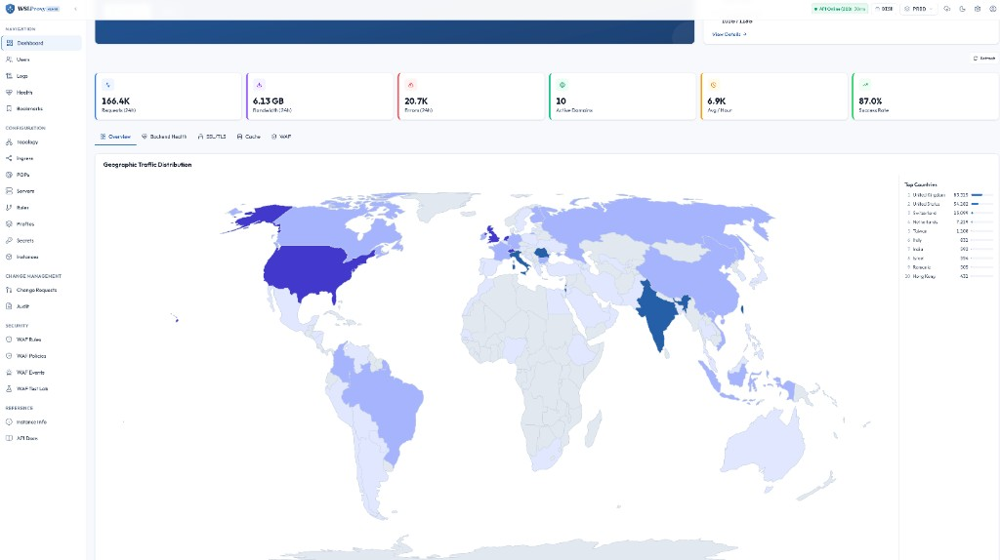

# Geographic Traffic Distribution by country

**WSLProxy feature deep dive** · [2-minute video](https://youtu.be/4G_YPYj3J3k) · [Live article on wslproxy.org](https://wslproxy.org/blog/geographic-traffic-distribution.html)

See where clients hit your edge — **Top Countries** ranked by request volume and a live **world choropleth** — without leaving the admin dashboard.

## Why geo traffic belongs in the control plane

Edge operators already know *how much* traffic they serve. The harder question is *from where*. Country-level demand drives WAF geo rules, capacity planning, POP placement, and abuse response. WSLProxy records country on the request path and surfaces it next to Overview KPIs (requests, bandwidth, errors, success rate).

## What the dashboard shows

| Panel | Purpose |
|-------|---------|
| **Top Countries** | Ranked ISO countries with request counts for the selected window |
| **World choropleth** | Countries shaded by volume for at-a-glance hotspots |
| **Overview context** | Same strip as Requests / Bandwidth / Errors / Active Domains / Success Rate |

## How it works on the hot path

1. **Client IP** — typically `ngx.var.remote_addr` (honor real-IP when behind Cloudflare or another edge).
2. **IP2Location** — `geo_lookup` / `log_handler` open the BIN from `settings.ip2location_path` (with on-disk fallbacks to the ansible OpenResty install path).
3. **Normalize** — IP2Location `UK` → ISO `GB` so world-atlas polygons match.
4. **Aggregate** — counts in the `traffic_stats` shared dict.
5. **API → UI** — `/api/traffic/stats` feeds `GeoTrafficMap` (React Admin + Next.js).

> If access logs show `INVALIDDATABASEFILE`, the configured DB path is missing — fix `ip2location_path` or the `/tmp` symlink ansible maintains, then reload OpenResty.

## Platform features this sits beside

- **Dynamic routing** — path / IP / country / JWT / S3 / cookie match without nginx reloads for rules
- **Traffic engineering** — weighted, canary, sticky, least-conn
- **WAF** — policy packs, monitor/block, geo deny lists
- **SSL & cache** — auto-ssl, edge static cache, optional Varnish
- **Observability** — `/metrics` for Prometheus/Grafana plus in-product traffic stats
- **Control plane** — Admin UI, Swagger REST, MCP, `wslproxy-cli`

## Operate it in production

- Keep the IP2Location BIN installed (`cdn-dependencies` → `/usr/local/openresty/nginx/…`).
- Do not leave Vault/SOPS pointing at a deleted `/tmp` copy after install.
- Reload OpenResty after path fixes so workers re-init `IP2LocationPath`.
- For fleet charts, scrape `job=wslproxy-edges` into obs Prometheus / Grafana.

## Links

- Video: https://youtu.be/4G_YPYj3J3k
- Full intro: https://youtu.be/7NJulclG5sQ
- Site: https://wslproxy.org
- Repo: https://github.com/bwalia/wslproxy
