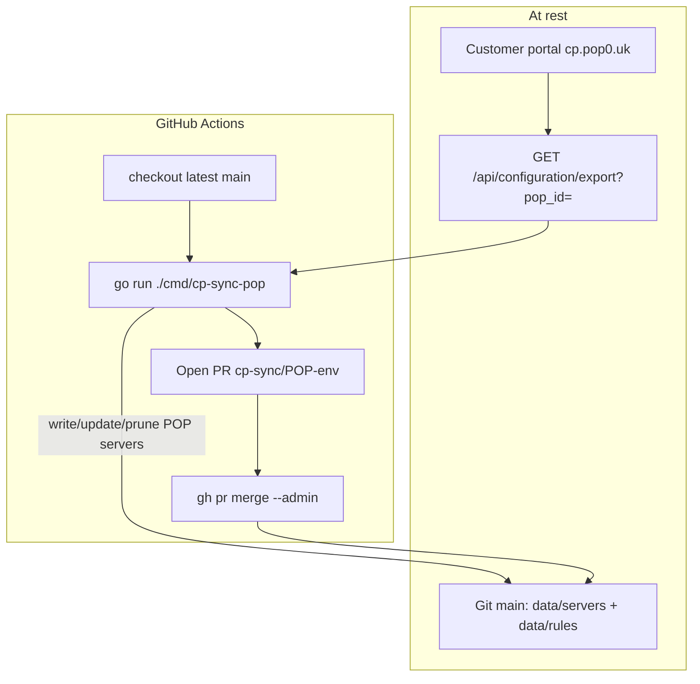
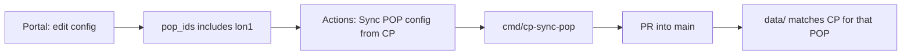

# Control plane → git → POP configuration

Customers enter servers, rules, WAF, and `api_gw` on the **control plane**
portal at [`cp.pop0.uk`](https://cp.pop0.uk) (k3s). That is the source of
truth. Traffic POPs (`lon1.pop0.uk`, etc.) are bare-metal edges.

Records are tagged with a POP via server `pop_ids` (see `data/pops/` and
`api/pops.lua`). A GitHub Actions workflow runs a **Go** tool that pulls the
latest POP-filtered snapshot from the CP API into this repo’s `data/` tree,
opens a PR, and merges to `main`.

Related: SOPS secrets [`../secrets/README.md`](../secrets/README.md);
edge failover mirror [`../edge-sync/README.md`](../edge-sync/README.md).

---

## How CP → git sync works

### At rest

| What | Where |
|------|--------|
| Desired config (SoT) | Customer portal on `cp.pop0.uk` |
| POP tag | Server `pop_ids` (e.g. `["lon1"]`) |
| Git mirror of SoT | `data/servers\|rules\|waf_*\|secrets/<env>/` on `main` |
| Live POP | `/opt/nginx/data/…` on bare metal (deployed separately) |

### Sync flow (Go + PR)



### Operator path



### ASCII

```
  Customer enters config on cp.pop0.uk
              │  pop_ids: ["lon1"]
              ▼
  workflow: cp-sync-pop-to-git.yml
              │  checkout main
              ▼
  go run ./cmd/cp-sync-pop -pop lon1 -env prod
              │  GET /api/configuration/export?pop_id=lon1&env=prod
              ▼
  write data/{servers,rules,waf_*,secrets}/prod/
              │  prune servers tagged lon1 but missing from export
              ▼
  PR → merge → main
```

---

## Tooling

| Piece | Role |
|-------|------|
| [`cmd/cp-sync-pop`](../../cmd/cp-sync-pop) | Go client: fetch CP export → write `data/` |
| [`cp-sync-pop-to-git.yml`](../../.github/workflows/cp-sync-pop-to-git.yml) | Checkout main → Go sync → PR → merge |
| `GET /api/configuration/export` | CP API ([`api/configuration_export.lua`](../../api/configuration_export.lua)) |
| Secrets `CP_API_USER` + `CP_API_PASSWD` | Preferred — workflow mints a fresh JWT via `POST /api/user/login` before each sync |
| Secret `CP_API_TOKEN` | Optional static JWT fallback |

Local dry-run:

```bash
# Mint once, or use a long-lived token:
export CP_TOKEN="$(curl -sS -X POST https://cp.pop0.uk/api/user/login \
  -H 'Content-Type: application/json' \
  -d '{"email":"…","password":"…"}' | jq -r '.data.accessToken')"
go run ./cmd/cp-sync-pop -pop lon1 -env prod -dry-run
```

---

## Race guards

- Concurrency group `cp-sync-pop-<pop>-<env>` — one sync at a time per POP.
- Always starts from latest `main` before writing.
- PR branch `cp-sync/<pop>-<env>` replaced each run; merge is explicit.
- Servers tagged with the POP but absent from the CP export are **removed** from `data/servers/<env>/`. Shared rules are not deleted if other servers still need them.
- Delivery `push_repo_data: auto` still skips lon1/pop0 so routine code deploys do not clobber live edges; use **Deploy POP config** (or `push_repo_data=always`) when applying git → edge.

---

## Stopped: lon1/S3 → CP contamination

| Workflow | Change |
|----------|--------|
| `restore-prod-data-from-s3-to-git.yml` | Manual DR only (`confirm_dr=RESTORE-FROM-S3`); no auto-run after Sync Prod→S3 |
| Delivery `push_repo_data: auto` | Skips lon1 and pop0 |

---

## Optional POP artifact tree

`infra/configuration/pops/<pop>/` remains available for edge-only artifact
deploys (`export-pop-config` / `deploy-pop-config`). The **primary** SoT mirror
in git is now `data/` via `cmd/cp-sync-pop`.

---

## Status

- CP export API + Go sync + PR workflow: **in place**
- Portal “Publish” button can dispatch `cp-sync-pop-to-git.yml` via GitHub API
