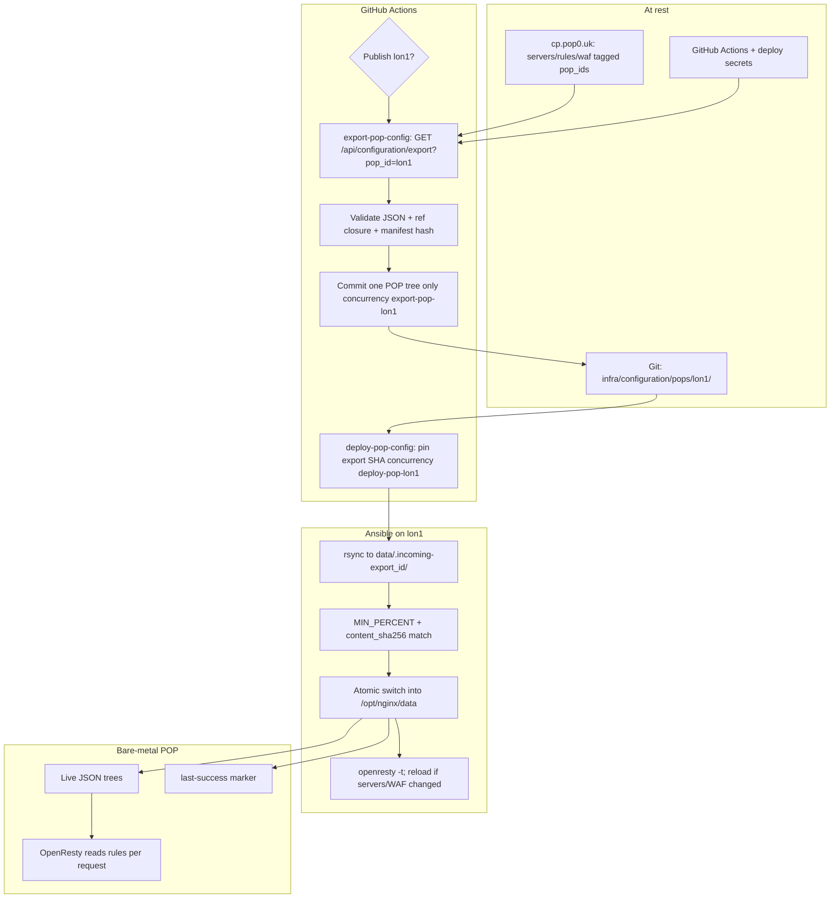
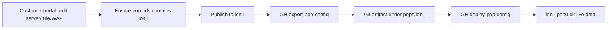

# Control plane → POP configuration

Desired routing config (servers, rules, WAF, `api_gw` on servers, referenced
secrets) lives on the **control plane** customer portal at `cp.pop0.uk`
(k3s). Traffic POPs such as `lon1.pop0.uk` are bare-metal OpenResty edges.
Records are tagged with a POP via server `pop_ids` (see `data/pops/` and
`api/pops.lua`). A GitHub Actions pipeline **exports** a POP-filtered
snapshot into this directory, then **deploys** that immutable revision to
the target POP.

CP is the source of truth. Edge-local config edits are break-glass only;
the next successful sync overwrites them unless the change is promoted
back to CP first.

Related: SOPS deploy-time secrets flow in [`../secrets/README.md`](../secrets/README.md);
lon1→pop0 failover mirror in [`../edge-sync/README.md`](../edge-sync/README.md).

---

## Directory layout

```text
infra/configuration/
  README.md                 ← you are here
  pops/
    lon1/
      manifest.json         ← pop_id, env, export_id, content_sha256, exported_at
      servers/*.json
      rules/*.json
      waf_policies/*.json
      waf_rules/*.json      ← only those referenced by exported servers
      secrets/*.json        ← AES-256-GCM blobs only; never plaintext keys
    pop0/                   ← optional; prefer edge-sync from lon1 for failover
```

Do **not** publish POP routing trees under top-level `data/servers|rules` for
this pipeline. Delivery deploys already rsync that path and have clobbered
edges before (CLAUDE.md gotcha 22). Artifacts for CP→POP live here under
`pops/<pop_id>/`.

---

## How CP → POP config sync works

Same style as the SOPS README: at-rest table, deploy mermaid, operator path,
ASCII backup.

### At rest

| What | Where |
|------|--------|
| Desired config (SoT) | Control plane `cp.pop0.uk` (customer portal → CP API / pgsql or disk) |
| POP tag on records | Server field `pop_ids` (e.g. `["lon1"]`); POP registry in `data/pops/*.json` on CP |
| Published artifact | Git `infra/configuration/pops/<pop_id>/` (`manifest.json` + trees) |
| Live traffic config | Bare-metal POP `/opt/nginx/data/{servers,rules,waf_*,secrets}/` |
| Apply cursor | POP host `/var/lib/wslproxy-pop-config/last-success` (`sha`, `export_id`, `content_sha256`) |

### Deploy flow (Publish)



### Operator / portal path



### ASCII (same path)

```
  Customer portal (cp.pop0.uk)
              │  pop_ids: ["lon1"]
              ▼
  GET /api/configuration/export?pop_id=lon1&env=prod
              │  snapshot + manifest (export_id, content_sha256)
              ▼
  GitHub Actions export-pop-config
              │  concurrency: export-pop-lon1
              ▼
  git: infra/configuration/pops/lon1/{manifest,servers,rules,waf_*,secrets}/
              │
              ▼
  GitHub Actions deploy-pop-config (pinned SHA)
              │  concurrency: deploy-pop-lon1
              ▼
  Ansible: incoming dir → validate → atomic swap → /opt/nginx/data
              │
              ▼
  lon1 OpenResty (rules hot-read; reload only if needed)
```

---

## Race guards and resilience

| Risk | Mitigation |
|------|------------|
| Two exports overwrite each other | `concurrency: group: export-pop-<pop_id>` |
| Export + deploy race on `main` | Deploy pins **export commit SHA**; path-filter per POP |
| Partial rsync | Incoming dir + `content_sha256` + `MIN_PERCENT` before live swap |
| Delivery pipeline clobbers POP | Do not `push_repo_data` top-level `data/servers\|rules` onto POP-owned hosts |
| CP changes mid-export | Point-in-time snapshot with `export_id` in `manifest.json` |
| Deleted on CP, stale on edge | Full replace of POP tree after guards (missing files deleted) |
| Secrets in git | AES blobs only; encryption key stays Vault/SOPS settings |
| Wrong POP | Filter strictly by `pop_ids`; alert on untagged prod servers |
| Failover double-writer | pop0 mirrors lon1 via edge-sync; do not also CP-export the same vhosts to pop0 |

---

## Workflows (planned)

| Workflow | Role |
|----------|------|
| `export-pop-config.yml` | Pull CP bundle → write `pops/<pop>/` → commit |
| `deploy-pop-config.yml` | Apply pinned SHA to bare-metal POP |

Portal **Publish** dispatches export (then deploy) for a chosen `pop_id`.

---

## manifest.json (planned shape)

```json
{
  "pop_id": "lon1",
  "env_profile": "prod",
  "export_id": "uuid",
  "content_sha256": "…",
  "source_host": "cp.pop0.uk",
  "exported_at": "2026-10-01T12:00:00Z",
  "record_counts": {
    "servers": 0,
    "rules": 0,
    "waf_policies": 0,
    "waf_rules": 0,
    "secrets": 0
  }
}
```

---

## Break-glass / rollback

- **Edge break-glass:** edit on POP only if CP is unreachable; promote back to CP before the next sync, or accept overwrite.
- **Rollback:** redeploy a previous git SHA via `deploy-pop-config` input, or revert the export commit and redeploy.
- **Drift:** compare POP `last-success.content_sha256` to git `manifest.json`.

---

## Status

Documentation and diagrams only. Export API, workflows, and Ansible atomic
apply are tracked in the CP→POP config sync plan — not implemented in this
commit.
