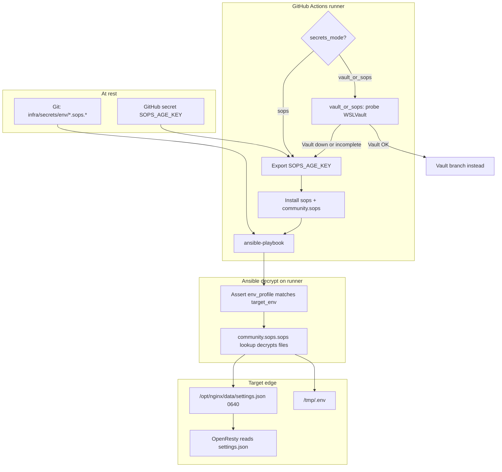
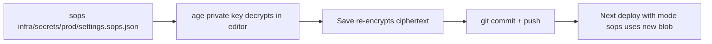

# SOPS + age secrets for wslproxy deploys

This directory holds the **encrypted** secret files that drive each
environment's deploy.  The files are safe to commit — they're
useless to anyone without the matching age private key.

```
infra/secrets/
├── README.md                ← you are here
├── int/
│   ├── settings.sops.json   ← becomes /opt/nginx/data/settings.json on int
│   └── env.sops.env             ← becomes /tmp/.env on int
├── test/
│   ├── settings.sops.json
│   └── env.sops.env
├── acc/
│   ├── settings.sops.json
│   └── env.sops.env
└── prod/
    ├── settings.sops.json
    └── env.sops.env
```

SOPS is **deploy-time only**. OpenResty never talks to SOPS or age at
request time; it only reads the plaintext `settings.json` Ansible
already wrote on the host.

Day-to-day deploys prefer **WSLVault** (`secrets_mode: vault` /
`vault_or_sops`). SOPS is the **break-glass** path when Vault is down
or incomplete — see [How deploy decrypt works](#how-deploy-decrypt-works)
below. The age **private** key must never live in Vault (circular
dependency if Vault is the outage).

---

## How deploy decrypt works

### At rest

| What | Where |
|------|--------|
| Ciphertext | This directory in git (`*.sops.json`, `*.sops.env`) |
| Age **public** recipient | Inside each file's `"sops"."age"[].recipient` (safe to commit) |
| Age **private** key | GitHub Actions secret `SOPS_AGE_KEY` (`AGE-SECRET-KEY-1…`); also password manager + offline sealed copy for laptop Ansible |

### Deploy flow



ASCII (same path):

```
                  ┌─→ infra/secrets/<env>/settings.sops.json  (in Git)
GitHub Actions ───┤   infra/secrets/<env>/env.sops.env            (in Git)
                  │              ↓
                  └─→ runner exports SOPS_AGE_KEY from GH secret
                                 ↓
                  Ansible's community.sops.sops lookup decrypts
                                 ↓
                  /opt/nginx/data/settings.json on target
                  /tmp/.env on target
```

Wiring:

1. CI picks mode (`sops`, or `vault_or_sops` → falls back to SOPS if Vault fails).
2. Runner exports `SOPS_AGE_KEY` from GitHub Secrets; installs `sops` + `community.sops`.
3. Ansible ([`roles/wslproxy/tasks/deploy_data.yml`](../ansible/roles/wslproxy/tasks/deploy_data.yml)) decrypts on the **runner** (no Vault HTTP), asserts `env_profile == target_env`, copies plaintext to the **target**.
4. OpenResty uses `/opt/nginx/data/settings.json` only.

No HTTP calls on the SOPS path. No token TTLs. The deploy fails fast if
the age key is missing or the file is corrupt.

### Operator edit path



After a successful deploy, losing Vault or SOPS does not take down the
edge until the next deploy that needs to rewrite secrets.

---

## What the `"sops": { ... }` metadata block is

Every `*.sops.json` ends with a `"sops"` object. That is **SOPS bookkeeping**,
not application settings. Example shape:

```json
"sops": {
  "age": [
    {
      "enc": "-----BEGIN AGE ENCRYPTED FILE-----\n...",
      "recipient": "age1n5h080hae9czwpsgfgz4vapxd86ud2742maxc5gezurlwzs9ee7s07e0k4"
    }
  ],
  "lastmodified": "2026-07-04T00:15:30Z",
  "mac": "ENC[AES256_GCM,data:...,iv:...,tag:...,type:str]",
  "unencrypted_suffix": "_unencrypted",
  "version": "3.13.2"
}
```

| Field | Meaning |
|-------|---------|
| `age` | Encrypted with [age](https://age-encryption.org), not PGP/AWS KMS |
| `age[].recipient` | Public age key that can decrypt (safe to commit) |
| `age[].enc` | Tiny age-encrypted wrap of the data encryption key (DEK). Only the matching **private** key (`SOPS_AGE_KEY`) can open this |
| `mac` | Integrity check — tampering with ciphertext fails decrypt |
| `lastmodified` | When this file was last re-encrypted |
| `version` | SOPS CLI version that wrote the file |
| `unencrypted_suffix` | Keys ending in `_unencrypted` stay plaintext (unused in our settings) |

Decrypt chain: `SOPS_AGE_KEY` unlocks `age[].enc` → DEK → DEK decrypts every
`ENC[AES256_GCM,…]` value in the JSON body above the metadata block.

The long `-----BEGIN AGE ENCRYPTED FILE-----` blob is **not** your JWT or
settings payload — it is only the wrapped DEK. The `recipient` line is the
public half of the same keypair as GitHub `SOPS_AGE_KEY`.

---

## Break-glass key custody

| Location | Role | Available when Vault down? |
|----------|------|----------------------------|
| GitHub Actions secret `SOPS_AGE_KEY` | Primary for CI/CD | Yes |
| Password manager (ops shared vault) | Laptop / manual Ansible | Yes |
| Offline sealed copy | Last resort | Yes |
| This git directory | Ciphertext only | N/A |
| WSLVault | **Do not store** the age private key here | Would defeat break-glass |

When Vault is down: re-run deploy with `secrets_mode: sops`, or rely on
`vault_or_sops` auto-fallback. No Vault token required.

---

## One-time setup (operator)

You need to do this **once per environment** that should use SOPS.
After this, every commit-and-deploy uses the encrypted files in
this directory.

### 1. Install age + sops on your laptop

```bash
# macOS
brew install age sops

# Linux (Debian / Ubuntu)
sudo apt-get install age
SOPS_VERSION=3.9.4
curl -fsSL "https://github.com/getsops/sops/releases/download/v${SOPS_VERSION}/sops-v${SOPS_VERSION}.linux.amd64" \
    -o /tmp/sops
sudo install -m 0755 /tmp/sops /usr/local/bin/sops
```

Verify:

```bash
age --version    # → 1.x.x
sops --version   # → 3.9.x
```

### 2. Generate an age keypair

```bash
mkdir -p ~/.config/sops/age
age-keygen -o ~/.config/sops/age/wslproxy.txt
chmod 600 ~/.config/sops/age/wslproxy.txt
```

The file looks like:

```
# created: 2026-06-29T12:34:56+00:00
# public key: age1qabcdefg…   ← share this freely (in .sops.yaml below)
AGE_SECRET_KEY-1XYZ123ABC…    ← NEVER share this
```

**You will use the `age1…` public key in step 3 and the
`AGE_SECRET_KEY-1…` private key in step 5.**

### 3. Wire the public key into `.sops.yaml`

At the repo root, edit `.sops.yaml`:

```yaml
creation_rules:
  - path_regex: infra/secrets/.+\.sops\.(json|env|yaml|yml)$
    age: age1qabcdefg…   # ← paste your public key here
```

Multiple `age:` recipients (comma-separated) lets multiple operators
encrypt new versions without sharing the private key.  Each operator
adds their public key to the list; all of them can encrypt; only
holders of the matching private key can decrypt.

### 4. Encrypt the per-environment files

For each environment you want to migrate (start with int):

```bash
# Have your current settings.json + .env ready locally
cd <repo-root>

# Encrypt settings.json (one file → one .sops.json file)
sops --encrypt data/settings.json > infra/secrets/int/settings.sops.json

# Encrypt .env file
sops --encrypt --input-type env --output-type env \
    /path/to/your/.env > infra/secrets/int/env.sops.env

# Sanity check: can you decrypt them back?
sops --decrypt infra/secrets/int/settings.sops.json | jq . | head -10
sops --decrypt infra/secrets/int/env.sops.env | head -5
```

Commit the `.sops.json` / `.sops` files to Git — they're encrypted.

> **Do NOT commit the plaintext `data/settings.json` or any
> unencrypted `.env`.**  `data/` is in `.gitignore` so this is
> usually already enforced, but double-check `git status` before
> committing.

### 5. Set the GitHub Secret `SOPS_AGE_KEY`

```bash
gh secret set SOPS_AGE_KEY \
    --repo bwalia/wslproxy \
    --body "$(cat ~/.config/sops/age/wslproxy.txt | grep AGE_SECRET_KEY-)"
```

Verify it's there:

```bash
gh secret list --repo bwalia/wslproxy | grep SOPS_AGE_KEY
```

### 6. Switch the environment over

In `.github/workflows/deploy-wslproxy-delivery-pipeline.yml` (or the
promotion pipeline), find the `deploy-int` call site and change:

```yaml
secrets_mode: vault   # ← was this
```

to:

```yaml
secrets_mode: sops
```

Then in the `secrets:` block, you can drop `VAULT_ADDR` /
`VAULT_TOKEN` for that environment and add:

```yaml
secrets:
  SOPS_AGE_KEY: ${{ secrets.SOPS_AGE_KEY }}
```

Commit, push, watch the deploy.  The new flow:

- ✅ Stage 1: Build & Validate
- ✅ Stage 1.5: Probe Int Runner
- ✅ Stage 2: Deploy Int
  - ✅ Checkout / Install / Build
  - ✅ Install SOPS + age + community.sops collection
  - ✅ Export SOPS age key
  - ✅ Run Ansible Playbook (decrypts settings + env, writes to target)
  - ✅ Health gate
- ✅ Stage 3+: continues to test, prod

---

## Day-to-day operations

### Editing a secret

```bash
# Sops auto-detects encryption via the .sops.yaml rules.
sops infra/secrets/int/settings.sops.json
# → opens $EDITOR with the DECRYPTED content
# → on save, re-encrypts with the recipients in .sops.yaml
```

Commit the file as usual.  The encryption is deterministic — diffs
in Git are clean (only the values that changed show up).

### Adding a new operator

The new operator generates their own age key (step 2), shares their
**public** key (step 3) — you add it to `.sops.yaml` then run:

```bash
sops updatekeys infra/secrets/int/settings.sops.json
sops updatekeys infra/secrets/int/env.sops.env
# (etc for every encrypted file)
```

This re-encrypts the files with the new recipient list.  The new
operator can now decrypt and edit.

### Removing an operator

Remove their public key from `.sops.yaml`, run `sops updatekeys` on
every file.  Their old key can no longer decrypt the new encrypted
files.  (Existing already-committed versions remain readable to
them via Git history until a `git filter-repo` rewrite — same as
any secret rotation.)

### Rotating SOPS_AGE_KEY

1. Generate a new keypair (step 2 again — use a new filename).
2. Add the new public key to `.sops.yaml`.
3. `sops updatekeys` on every file.
4. Update the GitHub Secret `SOPS_AGE_KEY` to the new private key.
5. After verifying the next deploy works, remove the old public key
   from `.sops.yaml` and run `sops updatekeys` once more.

### Rolling back after a deploy

The encrypted files are in Git.  `git revert` the change → next
deploy applies the previous version.  Same as any code rollback.

---

## Troubleshooting

### "no matching key found" during decrypt

The private key on the runner (`SOPS_AGE_KEY` GitHub secret) doesn't
match any of the recipients in the file's metadata.  Either:
- You rotated the key but didn't `sops updatekeys` on the file, or
- You haven't set `SOPS_AGE_KEY` yet on GitHub.

### "no creation rule matched"

The path doesn't match any `path_regex` in `.sops.yaml`.  Either:
- The file isn't under `infra/secrets/`, or
- The extension isn't `.sops.json` / `.sops.env` / etc.

### Ansible task `community.sops.sops` lookup fails

Either the `community.sops` collection isn't installed (the workflow
step `Install SOPS + age + community.sops collection` handles this
— check it ran) or the `sops` binary isn't on `$PATH` for the
ansible-playbook process.  Run `which sops` on the runner.

### Where is my key file?

The GitHub Action exports `SOPS_AGE_KEY` directly as an env var
(not a file).  `sops` checks `$SOPS_AGE_KEY` before looking at
`~/.config/sops/age/keys.txt`, so no key file ever lands on the
runner — the key lives in the GitHub Secret and in process memory
only.

---

## See also

- [SOPS docs](https://github.com/getsops/sops)
- [age docs](https://age-encryption.org)
- [community.sops Ansible collection](https://github.com/ansible-collections/community.sops)
- `infra/ansible/roles/wslproxy/tasks/deploy_data.yml` — the
  Ansible tasks that decrypt + write the files
- `.github/workflows/deploy-environment.yml` — the workflow steps
  that install sops + export the key
